# Escape from Ruins
## Processing Game Engine Project:

“Escape from Ruins” is an arcade runner type of game. The player has to escape the ruins that
are filled with traps. However, our greedy character will not just escape the ruins. The character
will try to collect as many coins that are randomly scattered on the ground while escaping the
ruins within a certain time. If the player does not collect coins, they will not get any extra scores.
However, if the player focuses on collecting the coins and does not escape, the time will run out
and the player will die. To win the player needs to grab the key and reach the gate.
There are two versions of the game available, one with sound and one without sound. In order to
play with the sound you need to import the official processing library.

## Controls:
### Player Movement:

The player movements are simply done by pressing the “w, a, s, d” keys. The “w” and “s” keys
will allow the player to move in the z-axis, which is equivalent to side to side. The “a” and “d”
keys will move the player to the x-axis, which is equivalent to back-and-forth movement.

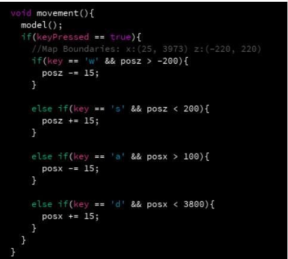

### Camera Movement:

The player will be able to move the camera by holding the mouse button while dragging it
around. They can also zoom in and zoom out by pressing the up and down arrow keys.

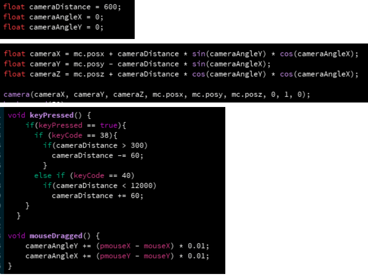

### Traps:

There are four types of traps in total. Whenever the player touches or makes contact with a trap,
it will be a game over for the player. The traps will trigger when the player is in specific
coordination.

#### Spikes:

Spikes will spawn from the ground when the
player triggers them. Once they are activated the
spikes will start to go up and down. The player
has to time it well to dodge the spikes. The player
will not die when the spikes are going and they
are not visible.

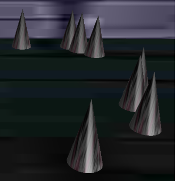

#### Stalactite:

Once they are triggered by
the player, the stalactites will
fall from the ceiling. The
player will die if he/she does
not dodge in time. Stalactites
will not disappear once they
are spawned. They will have
a red indicator in order to
warn the player where they
will land.

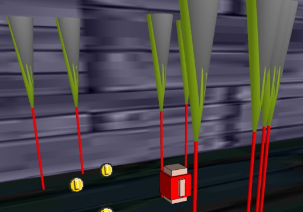

#### Arrows:

These arrows will also be launched
towards the player, at a certain
coordinate. The player needs to dodge
these if they don’t want to see the game
over the screen. These arrows will not
despawn and will stick to the wall they
were launched towards. They also have
a red indicator to notify the player that
danger is approaching.

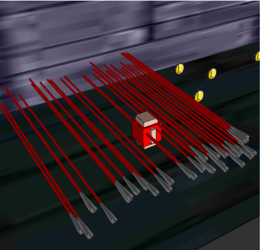

#### Magical Orbs:

Once again, when the player triggers the magical orb trap, a few magical orbs will appear and
they will bounce back and forth from one wall to another. The player will die if they make
contact with the orbs. Each orb has its own speed that is randomly assigned.

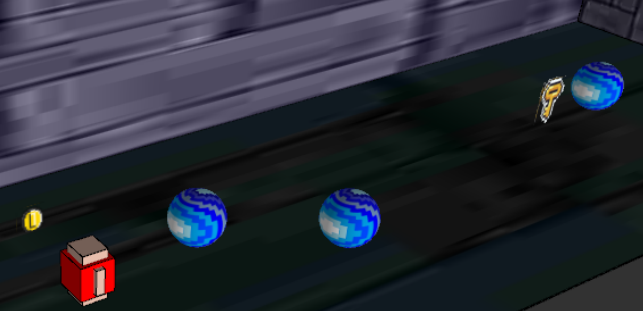

### Scoring System:

The scoring system is based on time and coin count. If the player finishes the game at a lower
time, he/she will get higher points. In order to increase the points, the player will have to grab the
coins on the ground.

The maths behind the scoring system:
 score=(remainingTime/1000*33)+(coinCount * 137)

#### Coins:

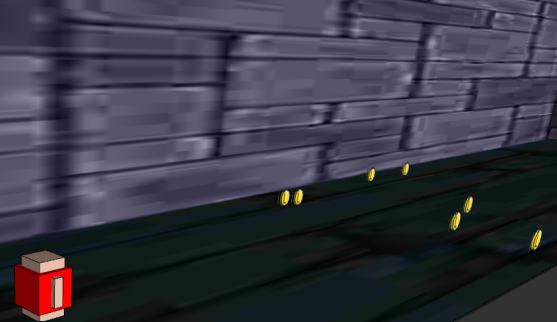

As it was mentioned before the coins will be scattered randomly throughout the ruin’s floor. The
player will collect them to gather extra points. There will be a coin counter on the top left part of
the screen.

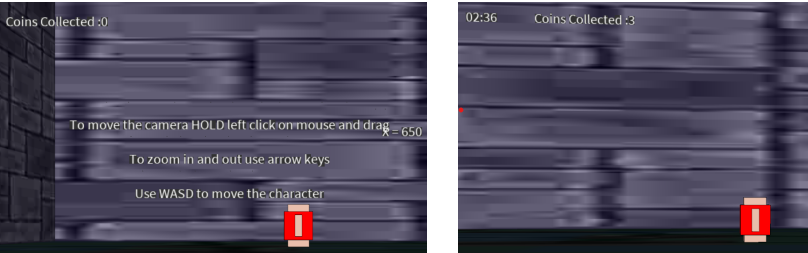

#### Timer:

Similar to the coin counter, the timer will be displayed next to the coin counter.

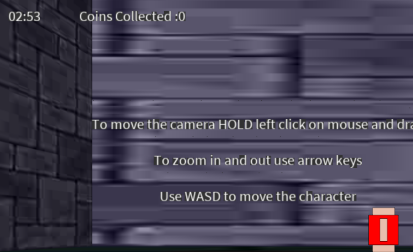

The timer will start counting down from three minutes. Once again if the timer reaches zero the
player will die.

#### Key:

To win the game, the player needs to acquire the key that is randomly placed in the ruins. Once the player grabs the
key and reaches the end of the ruins where there is a door. The screen will print the final score with the time.

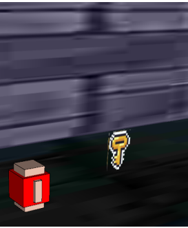

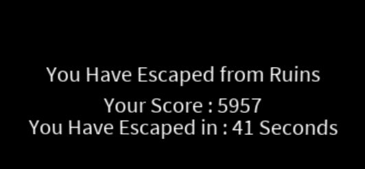

#### GameOver:

The game over screen will trigger when the player dies by a trap, or when the player presses the
“p” key.
The “Game Over” button
code:

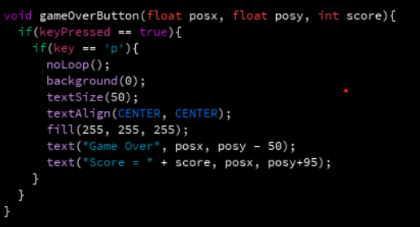

When the player dies due to a trap:

When the player presses the “p” key:

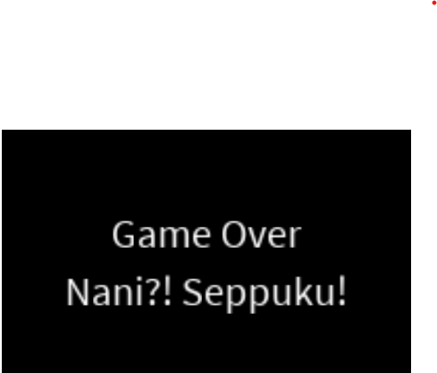

## Instructions

Base version to run is "Escape From Ruins_noSound". Make sure to run this version for testing unless Sound library is installed.
Make sure you have Processing version 4.2 or above.
To be able to run the Sound version you need to download and import Official Sound Library from Processing.
To download Official Sound Library follow the steps down below:
1) Launch processing.
2) Click on "Tools".
3) Click "Manage Tools..".
4) Go to the "Libraries" tab.
5) Type "sound" on the search bar.
6) Click on Sound library from Author: The Processing Foundation
7) Click to Install